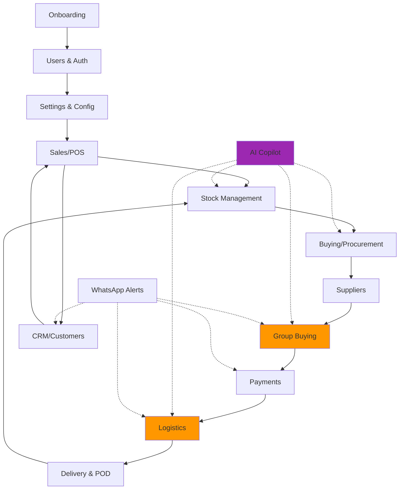
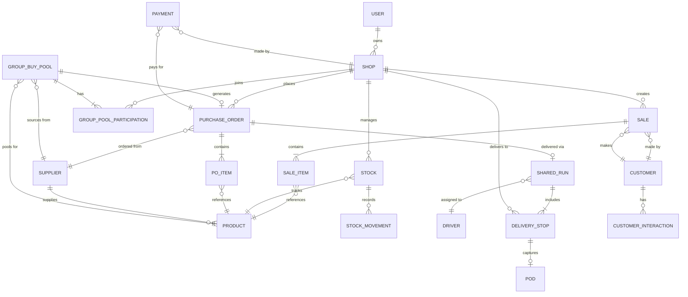

# TOSS End-to-End Data Flow Documentation

**Date:** October 23, 2025  
**Version:** 1.0  
**Purpose:** Complete data flow architecture showing how all TOSS modules interconnect

---

## 📊 System Architecture Overview



---

## 🔄 Complete Data Flow Journey

### Phase 1: Business Setup & Onboarding

#### 1.1 Onboarding → Users → Settings

**Flow:**
```
Shop Owner Signs Up
    ↓
[Onboarding Module]
    ↓ Creates
User Profile (name, phone, shop details, location)
    ↓ Initializes
[Users Module]
    ↓ Sets up
Default Settings (currency=ZAR, language, timezone, area)
    ↓ Creates
Shop Configuration (business hours, tax rate, payment methods)
```

**Data Created:**
```typescript
User: {
  id: "USR-001",
  name: "Thabo Mthembu",
  phone: "+27 71 234 5678",
  shopName: "Thabo's Spaza",
  location: {
    area: "Soweto",
    zone: "Diepkloof",
    coordinates: { lat: -26.2678, lng: 27.8585 }
  },
  role: "owner",
  status: "active"
}

Settings: {
  shopId: "SHOP-001",
  currency: "ZAR",
  taxRate: 15,
  language: "en",
  areaGroup: "soweto-central",
  paymentMethods: ["cash", "paylink"],
  whatsappAlerts: true
}
```

**Connections:**
- ✅ **Users** stores authentication & profile
- ✅ **Settings** stores shop configuration
- ✅ **CRM** can now track this shop's customer interactions

---

### Phase 2: Daily Sales Operations

#### 2.1 Sales/POS → Stock → CRM

**Flow:**
```
Customer Makes Purchase
    ↓
[POS/Sales Module]
    ↓ Records
Sale Transaction (items, quantities, payment)
    ↓ Triggers
[Stock Module] - Deduct Inventory
    ↓ Updates
Stock Levels (currentStock - soldQuantity)
    ↓ Checks
Low Stock Threshold?
    ↓ If YES
[AI Copilot] - Generate Reorder Suggestion
    ↓ Also Updates
[CRM Module] - Customer Purchase History
```

**Data Flow Example:**
```typescript
// SALE CREATED
Sale: {
  id: "SALE-2025-001",
  shopId: "SHOP-001",
  customerId: "CUST-042", // Optional
  items: [
    {
      sku: "BRD-WHT-001",
      name: "White Bread",
      quantity: 2,
      unitPrice: 12.50,
      total: 25.00
    }
  ],
  subtotal: 25.00,
  tax: 3.75,
  total: 28.75,
  paymentMethod: "cash",
  timestamp: "2025-10-23T14:30:00Z"
}

// STOCK UPDATED
StockMovement: {
  id: "STK-MOV-001",
  sku: "BRD-WHT-001",
  movementType: "sale",
  quantityBefore: 50,
  quantityChange: -2,
  quantityAfter: 48,
  refId: "SALE-2025-001",
  timestamp: "2025-10-23T14:30:00Z"
}

// CRM UPDATED
CustomerPurchase: {
  customerId: "CUST-042",
  shopId: "SHOP-001",
  saleId: "SALE-2025-001",
  totalSpent: 28.75,
  items: ["BRD-WHT-001"],
  frequency: 5, // 5th purchase this month
  lastVisit: "2025-10-23T14:30:00Z"
}
```

**Connections:**
- ✅ **Sales** records transaction
- ✅ **Stock** adjusts inventory in real-time
- ✅ **CRM** tracks customer behavior
- ✅ **AI Copilot** monitors for reorder triggers

---

### Phase 3: Stock Depletion & Reorder Trigger

#### 3.1 Stock → AI Copilot → Buying

**Flow:**
```
Stock Level Falls Below Minimum
    ↓
[Stock Module] - Emits Low Stock Event
    ↓
[AI Copilot] - Analyzes:
  • Sales velocity (avg daily sales)
  • Current stock level
  • Reorder history
  • Nearby shops' demand
    ↓ Decision Tree:
  ┌─ If similar demand from 3+ nearby shops
  │     ↓
  │  Suggest: "Join/Create Group Buy Pool"
  │     ↓
  └─ Else
      ↓
   Suggest: "Solo Reorder from Supplier"
    ↓
[Buying Module] - Draft Purchase Order
```

**AI Copilot Suggestion Data:**
```typescript
AICopilotSuggestion: {
  id: "AI-SUG-001",
  type: "reorder_opportunity",
  priority: "high",
  shopId: "SHOP-001",
  sku: "BRD-WHT-001",
  currentStock: 5,
  minStock: 50,
  avgDailySales: 15,
  daysUntilStockout: 0.33, // ~8 hours
  
  // GROUP BUY OPPORTUNITY
  groupBuyOpportunity: {
    available: true,
    nearbyShops: 4,
    combinedDemand: 300, // units
    potentialSavings: 12, // percentage
    existingPoolId: "GB-12", // or null if none exists
    message: "3 nearby shops buying same item. Join Pool #12 to save 12%"
  },
  
  // SOLO REORDER OPTION
  soloReorderOption: {
    suggestedQuantity: 100,
    supplier: "ABC Suppliers Ltd",
    unitPrice: 12.50,
    total: 1250.00,
    estimatedDelivery: "2025-10-24"
  },
  
  createdAt: "2025-10-23T14:35:00Z"
}
```

**Connections:**
- ✅ **Stock** triggers alert
- ✅ **AI Copilot** analyzes patterns
- ✅ **Buying** prepares options
- ✅ **Group Buying** checks for active pools

---

### Phase 4A: Group Buying Flow (CORE FEATURE)

#### 4A.1 Group Buying → Suppliers → Payments

**Flow:**
```
Owner Chooses "Join/Create Pool"
    ↓
[Group Buying Module]
    ↓ If Existing Pool
  Join Pool: Add quantity commitment
    ↓
  Update Pool Progress (48/100 crates)
    ↓
  Send WhatsApp Notification to participants
    ↓ If NEW Pool
  Create Pool:
    - Select SKU from [Suppliers]
    - Set target quantity
    - Set deadline
    - Set area/zone
    - Set split rule (flat/units)
    ↓
  Generate WhatsApp Invite Link
    ↓
  Track Pool Progress
    ↓ When Target Met OR Deadline Reached
  Pool Status: Open → Confirmed
    ↓
[Buying Module] - Create Aggregated PO
    ↓
PO sent to [Suppliers]
    ↓
[Payments Module] - Generate Pay Links
    ↓
Send Pay Links via WhatsApp to each participant
    ↓ When All Paid
Pool Status: Confirmed → Processing
    ↓
Supplier confirms order
    ↓
Create [Logistics] - Shared Delivery Run
```

**Group Buy Pool Data Structure:**
```typescript
GroupBuyPool: {
  id: "GB-12",
  poolNumber: "12",
  status: "open", // open | pending | confirmed | fulfilled | cancelled
  
  // PRODUCT DETAILS
  productSku: "BRD-WHT-001",
  productName: "White Bread",
  supplierId: "SUP-005",
  supplierName: "ABC Suppliers Ltd",
  
  // POOL PARAMETERS
  targetQuantity: 100, // units
  currentQuantity: 48,  // committed so far
  unitPrice: 11.00,     // group price (vs 12.50 solo)
  savingsPercent: 12,
  
  // GEOGRAPHY
  area: "Soweto",
  zone: "Diepkloof",
  
  // TIMING
  deadline: "2025-10-23T17:00:00Z",
  createdAt: "2025-10-22T10:00:00Z",
  
  // PARTICIPANTS
  participants: [
    {
      shopId: "SHOP-001",
      shopName: "Thabo's Spaza",
      quantity: 20,
      shareAmount: 220.00,
      status: "committed", // committed | paid | delivered
      joinedAt: "2025-10-22T10:05:00Z"
    },
    {
      shopId: "SHOP-015",
      shopName: "Mama Joy's Store",
      quantity: 15,
      shareAmount: 165.00,
      status: "committed",
      joinedAt: "2025-10-22T14:20:00Z"
    },
    {
      shopId: "SHOP-023",
      shopName: "Corner Quick Shop",
      quantity: 13,
      shareAmount: 143.00,
      status: "paid",
      joinedAt: "2025-10-23T09:15:00Z"
    }
  ],
  
  // COST BREAKDOWN
  totalPoolCost: 1100.00, // 100 units × R11
  costSplitRule: "by_units", // or "flat"
  
  // PURCHASE ORDER (after confirmation)
  purchaseOrderId: "PO-GB-12",
  
  // DELIVERY (after confirmation)
  sharedRunId: "SR-045"
}
```

**WhatsApp Messages Sent:**

```
// POOL CREATED
📦 New Group Buy Started!
Pool #12: White Bread
Target: 100 units @ R11 each (Save 12%!)
Deadline: Today 5pm
Join: https://toss.app/pool/GB-12

// POOL PROGRESS UPDATE
🎯 Pool #12 Progress: 48/100 units
White Bread - Closes in 4 hours
Join now: https://toss.app/pool/GB-12

// POOL CONFIRMED
✅ Pool #12 Confirmed!
100 units White Bread
Your share: 20 units = R220
Pay now: https://pay.toss.app/GB-12-SHOP-001

// PAYMENT RECEIVED
💰 Payment Received!
Pool #12 - R220 paid
Delivery: Tomorrow with 2 other shops
Track: https://toss.app/track/SR-045
```

**Aggregated Purchase Order Created:**
```typescript
AggregatedPurchaseOrder: {
  id: "PO-GB-12",
  type: "group_buy",
  poolId: "GB-12",
  supplierId: "SUP-005",
  
  items: [
    {
      sku: "BRD-WHT-001",
      name: "White Bread",
      quantity: 100,
      unitPrice: 11.00,
      total: 1100.00
    }
  ],
  
  subtotal: 1100.00,
  tax: 165.00,
  total: 1265.00,
  
  // PARTICIPANT BREAKDOWN
  shopOrders: [
    {
      shopId: "SHOP-001",
      quantity: 20,
      amount: 220.00,
      paymentStatus: "paid",
      paymentId: "PAY-001"
    },
    {
      shopId: "SHOP-015",
      quantity: 15,
      amount: 165.00,
      paymentStatus: "paid",
      paymentId: "PAY-002"
    },
    {
      shopId: "SHOP-023",
      quantity: 13,
      amount: 143.00,
      paymentStatus: "paid",
      paymentId: "PAY-003"
    }
  ],
  
  status: "confirmed",
  expectedDelivery: "2025-10-24",
  
  // SAVINGS TRACKING
  totalSavings: 150.00, // vs individual orders
  savingsPerShop: {
    "SHOP-001": 30.00,
    "SHOP-015": 22.50,
    "SHOP-023": 19.50
  }
}
```

**Connections:**
- ✅ **Group Buying** coordinates pool lifecycle
- ✅ **Suppliers** provides products & pricing
- ✅ **Buying** creates aggregated PO
- ✅ **Payments** handles individual pay links
- ✅ **WhatsApp** sends real-time updates
- ✅ **Logistics** prepares shared delivery

---

### Phase 4B: Solo Reorder Flow (Alternative Path)

#### 4B.1 Buying → Suppliers → Payments

**Flow:**
```
Owner Chooses "Solo Reorder"
    ↓
[Buying Module] - Create Individual PO
    ↓
Select [Supplier] from linked suppliers
    ↓
PO sent to supplier
    ↓
[Payments] - Generate pay link
    ↓
WhatsApp alert with pay link
    ↓
Owner pays
    ↓
Supplier confirms
    ↓
[Logistics] - Schedule individual delivery
```

**Solo Purchase Order:**
```typescript
SoloPurchaseOrder: {
  id: "PO-2025-045",
  type: "individual",
  shopId: "SHOP-001",
  supplierId: "SUP-005",
  
  items: [
    {
      sku: "BRD-WHT-001",
      name: "White Bread",
      quantity: 50,
      unitPrice: 12.50, // regular price (no group discount)
      total: 625.00
    }
  ],
  
  subtotal: 625.00,
  deliveryFee: 50.00,
  tax: 101.25,
  total: 776.25,
  
  paymentStatus: "pending",
  status: "confirmed",
  expectedDelivery: "2025-10-24"
}
```

---

### Phase 5: Shared Logistics Flow (CORE FEATURE)

#### 5.1 Logistics → Drivers → Delivery

**Flow:**
```
Supplier Confirms Order(s)
    ↓
[Logistics Module] - Analyzes:
  • Multiple orders for same supplier
  • Same delivery area/zone
  • Same delivery date
    ↓ If 2+ orders match criteria
  Create Shared Delivery Run
    ↓
  Assign to available [Driver]
    ↓
  Calculate:
    - Optimal route
    - Delivery fee split
    - Per-shop savings
    ↓
Send Run Details to Driver (mobile view)
    ↓
Driver accepts run
    ↓
WhatsApp: "Driver assigned, ETA 2pm"
    ↓
Driver starts route
    ↓
WhatsApp: "Out for delivery"
    ↓
For Each Stop:
  ├─ Driver arrives
  ├─ Capture POD (PIN or Photo)
  ├─ Update status: "Delivered"
  ├─ WhatsApp: "✓ Delivered! Your stock updated."
  └─ [Stock Module] - Add inventory
    ↓
All stops completed
    ↓
Run Status: Complete
    ↓
Show savings summary to each shop
```

**Shared Delivery Run Data:**
```typescript
SharedDeliveryRun: {
  id: "SR-045",
  runNumber: "045",
  status: "in_progress", // scheduled | assigned | in_progress | completed | failed
  
  // LOGISTICS DETAILS
  supplierId: "SUP-005",
  supplierName: "ABC Suppliers Ltd",
  pickupLocation: {
    name: "ABC Warehouse",
    address: "123 Industrial Rd, Johannesburg",
    coordinates: { lat: -26.1234, lng: 28.0567 }
  },
  
  // DRIVER
  driverId: "DRV-008",
  driverName: "Sipho Ndlovu",
  driverPhone: "+27 82 345 6789",
  vehicleCapacity: 500, // kg
  
  // ROUTE & STOPS
  area: "Soweto",
  zone: "Diepkloof",
  totalDistance: 8.5, // km
  estimatedDuration: 45, // minutes
  
  stops: [
    {
      stopNumber: 1,
      shopId: "SHOP-023",
      shopName: "Corner Quick Shop",
      address: "45 Main Rd, Diepkloof",
      coordinates: { lat: -26.2678, lng: 27.8585 },
      
      // DELIVERY ITEMS
      orderId: "PO-GB-12-SHOP-023",
      poolId: "GB-12",
      items: [
        {
          sku: "BRD-WHT-001",
          name: "White Bread",
          quantity: 13
        }
      ],
      
      // TIMING
      eta: "2025-10-24T14:15:00Z",
      arrivedAt: "2025-10-24T14:12:00Z",
      deliveredAt: "2025-10-24T14:18:00Z",
      
      // POD
      podType: "pin",
      podValue: "1234",
      podCapturedBy: "DRV-008",
      status: "delivered"
    },
    {
      stopNumber: 2,
      shopId: "SHOP-001",
      shopName: "Thabo's Spaza",
      address: "12 Church St, Diepkloof",
      coordinates: { lat: -26.2690, lng: 27.8600 },
      
      orderId: "PO-GB-12-SHOP-001",
      poolId: "GB-12",
      items: [
        {
          sku: "BRD-WHT-001",
          name: "White Bread",
          quantity: 20
        }
      ],
      
      eta: "2025-10-24T14:30:00Z",
      arrivedAt: null,
      deliveredAt: null,
      status: "en_route"
    },
    {
      stopNumber: 3,
      shopId: "SHOP-015",
      shopName: "Mama Joy's Store",
      address: "78 Valley Rd, Diepkloof",
      coordinates: { lat: -26.2705, lng: 27.8620 },
      
      orderId: "PO-GB-12-SHOP-015",
      poolId: "GB-12",
      items: [
        {
          sku: "BRD-WHT-001",
          name: "White Bread",
          quantity: 15
        }
      ],
      
      eta: "2025-10-24T14:45:00Z",
      arrivedAt: null,
      deliveredAt: null,
      status: "pending"
    }
  ],
  
  // COST BREAKDOWN
  totalDeliveryFee: 75.00, // vs 150 for 3 separate deliveries
  feePerShop: {
    "SHOP-023": 25.00,
    "SHOP-001": 25.00,
    "SHOP-015": 25.00
  },
  deliverySavingsPerShop: {
    "SHOP-023": 25.00, // saved R25
    "SHOP-001": 25.00,
    "SHOP-015": 25.00
  },
  
  // TIMESTAMPS
  scheduledFor: "2025-10-24T14:00:00Z",
  startedAt: "2025-10-24T13:45:00Z",
  completedAt: null
}
```

**Driver Mobile View API Response:**
```typescript
DriverRunView: {
  runId: "SR-045",
  status: "in_progress",
  progress: "1/3 delivered",
  
  pickup: {
    name: "ABC Warehouse",
    address: "123 Industrial Rd, Johannesburg",
    phone: "+27 11 234 5678",
    status: "collected"
  },
  
  currentStop: {
    stopNumber: 2,
    shopName: "Thabo's Spaza",
    contactPerson: "Thabo Mthembu",
    phone: "+27 71 234 5678",
    address: "12 Church St, Diepkloof",
    eta: "14:30",
    items: [
      { name: "White Bread", quantity: 20 }
    ],
    deliveryInstructions: "Ring bell twice"
  },
  
  remainingStops: [
    {
      stopNumber: 3,
      shopName: "Mama Joy's Store",
      eta: "14:45"
    }
  ],
  
  earnings: {
    baseFee: 75.00,
    tips: 0,
    total: 75.00
  }
}
```

**WhatsApp Notifications:**
```
// DRIVER ASSIGNED
🚚 Driver Assigned!
Sipho will deliver tomorrow at 2:30pm
Pool #12: White Bread (20 units)
Track: https://toss.app/track/SR-045

// OUT FOR DELIVERY
📍 Out for Delivery!
Sipho is on the way (Stop 2 of 3)
ETA: 2:30pm
Live tracking: https://toss.app/track/SR-045

// DELIVERED
✅ Delivered!
20 units White Bread received
Stock updated automatically
You saved R55 total! (R30 group + R25 shared delivery)
```

**Stock Update on Delivery:**
```typescript
StockMovement: {
  id: "STK-MOV-125",
  shopId: "SHOP-001",
  sku: "BRD-WHT-001",
  movementType: "purchase_received",
  quantityBefore: 5,
  quantityChange: +20,
  quantityAfter: 25,
  
  // REFERENCE DATA
  refType: "group_buy_delivery",
  refId: "PO-GB-12-SHOP-001",
  poolId: "GB-12",
  sharedRunId: "SR-045",
  
  // COST TRACKING
  unitCost: 11.00,
  totalCost: 220.00,
  deliveryFee: 25.00,
  totalSavings: 55.00, // group (30) + delivery (25)
  
  deliveredBy: "DRV-008",
  deliveredAt: "2025-10-24T14:32:00Z",
  podType: "pin",
  podVerified: true
}
```

**Connections:**
- ✅ **Logistics** coordinates shared runs
- ✅ **Drivers** execute multi-stop deliveries
- ✅ **Stock** updates on POD capture
- ✅ **Payments** tracks delivery fees
- ✅ **WhatsApp** provides real-time tracking updates

---

### Phase 6: CRM & Customer Lifecycle

#### 6.1 CRM Integration Across Modules

**Flow:**
```
[Sales] ──────────→ [CRM]
  Customer Purchase      ↓
                    Update Profile:
                    - Purchase history
                    - Spending patterns
                    - Visit frequency
                         ↓
[AI Copilot] ←────────┘
  Analyzes:              ↓
  - Loyalty tier    Suggest:
  - Preferences     - Promotions
  - Cart abandon    - Restock items
                    - WhatsApp offers
```

**CRM Customer Profile:**
```typescript
Customer: {
  id: "CUST-042",
  name: "Nomsa Dlamini",
  phone: "+27 73 456 7890",
  area: "Diepkloof",
  
  // PURCHASE BEHAVIOR
  totalSpent: 2450.00,
  visitCount: 23,
  avgTransactionValue: 106.52,
  lastVisit: "2025-10-23T14:30:00Z",
  frequency: "weekly",
  
  // PREFERENCES
  topCategories: ["Bakery", "Dairy", "Beverages"],
  topProducts: ["BRD-WHT-001", "MLK-FC-1L", "EGG-LRG-12"],
  
  // ENGAGEMENT
  whatsappOptIn: true,
  preferredContactTime: "morning",
  loyaltyTier: "silver",
  
  // SHOPS VISITED
  shopHistory: [
    {
      shopId: "SHOP-001",
      visitCount: 20,
      totalSpent: 2100.00,
      lastVisit: "2025-10-23T14:30:00Z"
    },
    {
      shopId: "SHOP-015",
      visitCount: 3,
      totalSpent: 350.00,
      lastVisit: "2025-10-15T11:20:00Z"
    }
  ]
}
```

---

## 🔁 Key Data Cycles

### Cycle 1: Sales → Stock → Buying → Group Buy → Logistics → Stock

```
Sale Depletes Stock
    ↓
Low Stock Triggers AI
    ↓
AI Suggests Group Buy
    ↓
Owner Joins Pool
    ↓
Pool Confirms → PO Created
    ↓
Shared Delivery Run Scheduled
    ↓
Driver Delivers → POD Captured
    ↓
Stock Replenished
    ↓
Ready for Next Sale
```

### Cycle 2: CRM → Sales → AI → Buying

```
Customer Purchase Pattern Detected
    ↓
AI Predicts Next Need
    ↓
Suggest Proactive Restock
    ↓
Owner Orders (Group/Solo)
    ↓
Stock Ready When Customer Returns
    ↓
Customer Satisfied → Loyalty Increased
```

### Cycle 3: Settings → All Modules

```
Settings Configuration
    ↓
Affects:
  ├─ Currency (ZAR) → Sales, Buying, Payments
  ├─ Tax Rate (15%) → Sales, Invoices
  ├─ Area/Zone → Group Buying, Logistics
  ├─ Language → UI, WhatsApp messages
  ├─ Payment Methods → POS, Payments
  └─ Alerts → WhatsApp notifications
```

---

## 📦 Key Data Entities & Their Relationships

### Entity Relationship Diagram



---

## 🎯 Critical Integration Points

### 1. **Group Buying ↔ Suppliers**
- Suppliers must support **volume-based pricing**
- Product catalog must include **group buy eligibility**
- Real-time inventory check for pool fulfillment

```typescript
SupplierProduct: {
  sku: "BRD-WHT-001",
  supplierId: "SUP-005",
  
  // PRICING TIERS
  pricing: [
    { minQty: 1, unitPrice: 12.50 },
    { minQty: 50, unitPrice: 12.00 },
    { minQty: 100, unitPrice: 11.00 }, // ← Group buy price
    { minQty: 500, unitPrice: 10.50 }
  ],
  
  // GROUP BUY CONFIG
  groupBuyEnabled: true,
  minPoolSize: 50,
  maxPoolSize: 500,
  leadTime: 24 // hours
}
```

### 2. **Logistics ↔ Group Buying**
- Shared runs auto-created for group buy deliveries
- Multi-stop routing based on pool participants' locations
- Cost splitting logic shared between modules

```typescript
LogisticsConfig: {
  autoCreateSharedRun: true,
  minStopsForSharing: 2,
  maxStopsPerRun: 8,
  maxRouteDistance: 15, // km
  
  // COST CALCULATION
  baseFee: 50.00,
  perStopFee: 15.00,
  perKmFee: 5.00,
  
  // FEE SPLIT OPTIONS
  splitMethods: [
    "equal", // divide equally among shops
    "by_weight", // based on order weight
    "by_distance", // based on distance from pickup
    "by_value" // based on order value
  ]
}
```

### 3. **AI Copilot ↔ All Modules**
- Monitors **Stock** for low levels
- Analyzes **Sales** patterns
- Checks **Group Buying** for opportunities
- Suggests **Logistics** optimizations

```typescript
AICopilotContext: {
  shopId: "SHOP-001",
  
  // INPUT SIGNALS
  signals: {
    stock: [
      { sku: "BRD-WHT-001", currentStock: 5, minStock: 50, avgDailySales: 15 }
    ],
    sales: {
      recentTrends: { "BRD-WHT-001": +42 }, // % increase
      seasonality: "high" // high demand period
    },
    groupBuying: {
      activePoolsNearby: 2,
      shopParticipation: "active"
    },
    logistics: {
      nearbyDeliveries: 3,
      sharedRunOpportunity: true
    }
  },
  
  // OUTPUT RECOMMENDATIONS
  recommendations: [
    {
      type: "join_group_buy",
      priority: "high",
      sku: "BRD-WHT-001",
      poolId: "GB-12",
      reasoning: "3 nearby shops buying. Save 12% + R25 delivery",
      estimatedSavings: 55.00,
      action: "one_tap_join"
    }
  ]
}
```

### 4. **WhatsApp Integration Layer**
- All modules can trigger WhatsApp messages
- Centralized message templates
- Delivery status tracking via links

```typescript
WhatsAppMessage: {
  recipientPhone: "+27 71 234 5678",
  templateId: "pool_confirmed",
  
  variables: {
    poolNumber: "12",
    productName: "White Bread",
    quantity: 20,
    amount: 220.00,
    payLink: "https://pay.toss.app/GB-12-SHOP-001"
  },
  
  // TRACKING
  sentAt: "2025-10-23T16:05:00Z",
  deliveredAt: "2025-10-23T16:05:03Z",
  readAt: "2025-10-23T16:06:12Z",
  clickedLink: true,
  clickedAt: "2025-10-23T16:06:45Z"
}
```

---

## 💡 Data Flow Optimizations

### 1. **Real-Time Updates**
- **WebSockets** for live pool progress
- **Push notifications** for delivery status
- **Instant stock updates** on POD capture

### 2. **Caching Strategy**
```typescript
CacheConfig: {
  // HOT DATA (real-time)
  hot: [
    "active_pools",
    "current_deliveries",
    "driver_locations",
    "stock_levels"
  ],
  ttl: 5, // seconds
  
  // WARM DATA (frequent access)
  warm: [
    "product_catalog",
    "supplier_details",
    "customer_profiles"
  ],
  ttl: 300, // 5 minutes
  
  // COLD DATA (infrequent access)
  cold: [
    "historical_sales",
    "completed_pools",
    "past_deliveries"
  ],
  ttl: 3600 // 1 hour
}
```

### 3. **Event-Driven Architecture**
```typescript
Events: {
  // STOCK EVENTS
  "stock.low_level": → [AI_Copilot, Buying],
  "stock.received": → [Stock, AI_Copilot],
  
  // GROUP BUY EVENTS
  "pool.created": → [WhatsApp, Nearby_Shops],
  "pool.joined": → [Pool_Participants],
  "pool.confirmed": → [Buying, Payments, Logistics],
  "pool.fulfilled": → [Stock, Payments],
  
  // LOGISTICS EVENTS
  "run.assigned": → [Driver, Shop_Participants],
  "run.started": → [Shop_Participants],
  "stop.arrived": → [Shop],
  "stop.delivered": → [Shop, Stock],
  "run.completed": → [Driver, All_Shops, Logistics],
  
  // PAYMENT EVENTS
  "payment.received": → [Buying, Supplier],
  "payment.failed": → [Shop, WhatsApp]
}
```

---

## 🔒 Data Security & Privacy

### Access Control Matrix

| Role | Sales | Stock | Buying | Group Buying | Logistics | CRM | Settings |
|------|-------|-------|--------|-------------|-----------|-----|----------|
| **Owner** | ✅ Full | ✅ Full | ✅ Full | ✅ Full | ✅ View | ✅ Full | ✅ Full |
| **Cashier** | ✅ Create | ✅ View | ❌ None | ❌ None | ❌ None | ✅ View | ❌ None |
| **Driver** | ❌ None | ❌ None | ❌ None | ❌ None | ✅ Assigned Runs | ❌ None | ❌ None |
| **Supplier** | ❌ None | ❌ None | ✅ View POs | ✅ Pool Details | ✅ Deliveries | ❌ None | ❌ None |

### Data Privacy Rules

```typescript
PrivacyRules: {
  // GROUP BUYING
  poolParticipants: {
    visible: ["shopName", "quantity"],
    hidden: ["ownerName", "phone", "exactAddress", "paymentDetails"]
  },
  
  // LOGISTICS
  deliveryInfo: {
    toDriver: ["shopName", "address", "phone", "items"],
    toShop: ["driverName", "phone", "vehicleDetails", "eta"],
    hidden: ["driverHome", "earnings", "otherStops"]
  },
  
  // CRM
  customerData: {
    retention: "2 years",
    anonymizeAfter: "inactive_1_year",
    exportable: true, // POPIA compliance
    deletable: true   // Right to be forgotten
  }
}
```

---

## 📊 Analytics & Reporting

### Cross-Module Reports

1. **Group Buying Impact Report**
```sql
SELECT 
  gb.pool_id,
  COUNT(gp.shop_id) as participants,
  SUM(gp.quantity) as total_units,
  SUM(gp.share_amount) as total_value,
  SUM(gp.savings) as total_savings,
  AVG(gp.savings) as avg_savings_per_shop
FROM group_buy_pools gb
JOIN group_pool_participation gp ON gb.id = gp.pool_id
WHERE gb.status = 'fulfilled'
GROUP BY gb.pool_id
```

2. **Shared Logistics Efficiency**
```sql
SELECT 
  sr.run_id,
  COUNT(ds.stop_id) as stops,
  sr.total_distance,
  sr.total_delivery_fee,
  SUM(ds.delivery_savings) as total_savings,
  sr.total_distance / COUNT(ds.stop_id) as km_per_stop
FROM shared_runs sr
JOIN delivery_stops ds ON sr.id = ds.run_id
WHERE sr.status = 'completed'
GROUP BY sr.run_id
```

3. **AI Copilot Effectiveness**
```sql
SELECT 
  suggestion_type,
  COUNT(*) as total_suggestions,
  SUM(CASE WHEN accepted = true THEN 1 ELSE 0 END) as accepted,
  AVG(estimated_savings) as avg_savings,
  SUM(actual_savings) as total_realized_savings
FROM ai_suggestions
WHERE created_at >= NOW() - INTERVAL '30 days'
GROUP BY suggestion_type
```

---

## 🚀 Next Steps & Roadmap

### Phase 1: Core Integration (Complete)
- ✅ Onboarding → Users → Settings
- ✅ Sales → Stock → Buying
- ✅ Group Buying implementation
- ✅ Shared Logistics implementation
- ✅ WhatsApp integration

### Phase 2: Advanced Features (In Progress)
- 🔄 Multi-SKU group buying baskets
- 🔄 Dynamic route optimization
- 🔄 Predictive AI for demand forecasting
- 🔄 Supplier ratings & reviews

### Phase 3: Scale & Optimize (Planned)
- 📅 Multi-region support
- 📅 Advanced analytics dashboard
- 📅 API marketplace for integrations
- 📅 Mobile app for drivers

---

## 📚 Documentation Links

- **[Group Buying Module](./SUPPLIERS_MODULE_MVP.md)**
- **[Shared Logistics](./LOGISTICS_IMPLEMENTATION_SUMMARY.md)**
- **[Supplier-Product Linking](./SUPPLIER_PRODUCT_LINKING.md)**
- **[MVP Completion Summary](./MVP_COMPLETION_SUMMARY.md)**
- **[Payment Integration](./PAYMENT_INTEGRATION_GUIDE.md)**

---

**Document Version:** 1.0  
**Last Updated:** October 23, 2025  
**Maintained By:** TOSS Development Team

