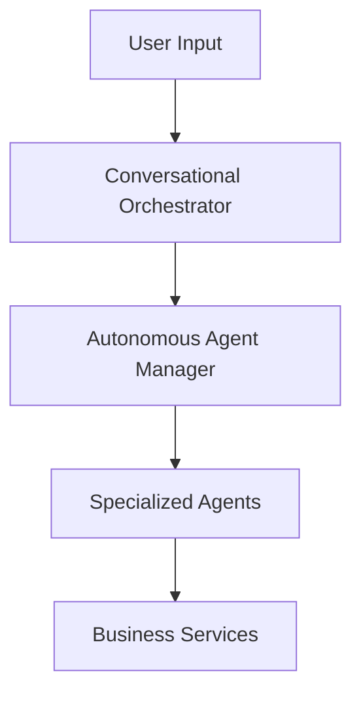

# TOSS ERP III Documentation Rules

## Overview

This document defines the standards and rules for all documentation in the TOSS ERP III project. These rules ensure consistency, completeness, and maintainability across all documentation.

## Documentation Structure

### File Naming Conventions

- **Use UPPERCASE with underscores** for main documentation files: `SERVICE_AS_SOFTWARE_IMPLEMENTATION.md`
- **Use lowercase with hyphens** for technical guides: `api-integration-guide.md`
- **Use PascalCase** for component-specific docs: `StockModule.md`
- **Use descriptive names** that clearly indicate content: `deployment-guide.md`

### Directory Organization

```
docs/
├── architecture/           # System architecture documentation
├── api/                   # API documentation and guides
├── deployment/            # Deployment and infrastructure guides
├── development/           # Development guides and standards
├── user-guides/           # End-user documentation
├── integration/           # Integration guides
└── troubleshooting/       # Troubleshooting and FAQ
```

## Content Standards

### 1. Document Headers

Every documentation file must include:

```markdown
# Document Title

## Overview
Brief description of what this document covers.

## Table of Contents
- [Section 1](#section-1)
- [Section 2](#section-2)

## Prerequisites
What readers need to know before reading this document.

## Related Documents
Links to related documentation.
```

### 2. Code Examples

- **Use syntax highlighting** for all code blocks
- **Include file paths** in code block headers
- **Provide complete, runnable examples**
- **Include expected outputs** where relevant
- **Use consistent indentation** (4 spaces for Markdown, 2 spaces for YAML)

```markdown
```csharp
// Example: src/Services/ai/Program.cs
public class Program
{
    public static void Main(string[] args)
    {
        // Implementation here
    }
}
```

**Expected Output:**
```
Service started successfully
Listening on port 5000
```
```

### 3. Diagrams and Visuals

- **Use Mermaid diagrams** for architecture and flow diagrams
- **Include alt text** for all images
- **Use consistent styling** across all diagrams
- **Provide both high-level and detailed views**

```markdown

```

### 4. API Documentation

For API documentation, include:

- **Endpoint description**
- **HTTP method and path**
- **Request parameters** (with types and validation)
- **Response format** (with examples)
- **Error codes** and handling
- **Authentication requirements**

```markdown
## POST /api/ai/conversation

Processes natural language conversation and returns AI response.

### Request Body
```json
{
    "userId": "string (required)",
    "message": "string (required)",
    "language": "string (optional, default: 'en')",
    "channel": "string (optional, default: 'web')"
}
```

### Response
```json
{
    "success": true,
    "response": "string",
    "actions": ["array of actions taken"],
    "timestamp": "ISO 8601 datetime"
}
```

### Error Codes
- `400 Bad Request`: Invalid request format
- `401 Unauthorized`: Missing or invalid authentication
- `500 Internal Server Error`: Server processing error
```

## Writing Guidelines

### 1. Tone and Style

- **Use clear, concise language**
- **Write for the target audience** (developers, business users, etc.)
- **Use active voice** when possible
- **Avoid jargon** unless necessary for technical accuracy
- **Provide context** for technical concepts

### 2. Technical Accuracy

- **Verify all code examples** work as written
- **Include version information** for dependencies
- **Test all procedures** before documenting
- **Update documentation** when code changes
- **Include troubleshooting sections** for common issues

### 3. Completeness

- **Cover all use cases** and edge cases
- **Include prerequisites** and dependencies
- **Provide step-by-step instructions** for procedures
- **Include examples** for all major features
- **Document error handling** and recovery procedures

### 4. Maintenance

- **Review documentation** with each release
- **Update examples** when APIs change
- **Remove outdated information** promptly
- **Add new sections** for new features
- **Validate links** and references regularly

## Service-as-a-Software Documentation Standards

### 1. Architecture Documentation

- **Include system diagrams** showing all components
- **Document data flows** between services
- **Explain decision points** and business logic
- **Show integration points** with external systems
- **Include performance characteristics** and limitations

### 2. API Documentation

- **Document all endpoints** with examples
- **Include authentication** and authorization details
- **Show request/response formats** for all operations
- **Document error handling** and status codes
- **Include rate limiting** and usage guidelines

### 3. User Guides

- **Provide step-by-step instructions** for common tasks
- **Include screenshots** or mockups where helpful
- **Show expected outcomes** for each action
- **Include troubleshooting** for common issues
- **Provide context** for business users

### 4. Integration Guides

- **Document integration patterns** and best practices
- **Include code examples** for common integrations
- **Show configuration** requirements
- **Document testing procedures** for integrations
- **Include security considerations**

## Quality Assurance

### 1. Review Process

- **Technical review** by subject matter experts
- **User experience review** for user-facing documentation
- **Accuracy verification** against actual implementation
- **Completeness check** against requirements
- **Consistency review** across all documentation

### 2. Validation Checklist

- [ ] All code examples compile and run
- [ ] All links work and are current
- [ ] All diagrams are accurate and clear
- [ ] All procedures are tested and verified
- [ ] All prerequisites are clearly stated
- [ ] All error conditions are documented
- [ ] All examples are relevant and helpful

### 3. Maintenance Schedule

- **Weekly**: Review and update based on code changes
- **Monthly**: Comprehensive review of all documentation
- **Quarterly**: Major updates and restructuring as needed
- **Annually**: Complete documentation audit and refresh

## Tools and Resources

### 1. Documentation Tools

- **Markdown editors**: VS Code with Markdown extensions
- **Diagram tools**: Mermaid, Draw.io, Lucidchart
- **Version control**: Git for tracking changes
- **Review tools**: GitHub PR reviews, peer reviews

### 2. Templates

- **API documentation template**
- **User guide template**
- **Architecture document template**
- **Troubleshooting guide template**

### 3. Style Guides

- **Microsoft Writing Style Guide** for technical writing
- **Google Developer Documentation Style Guide** for API docs
- **Project-specific terminology** and naming conventions

## Conclusion

Following these documentation rules ensures that TOSS ERP III documentation is:

- **Consistent** across all components and teams
- **Complete** with all necessary information
- **Accurate** and up-to-date with implementation
- **Usable** by the target audience
- **Maintainable** as the project evolves

These rules should be reviewed and updated regularly to reflect the evolving needs of the project and feedback from users and developers.
