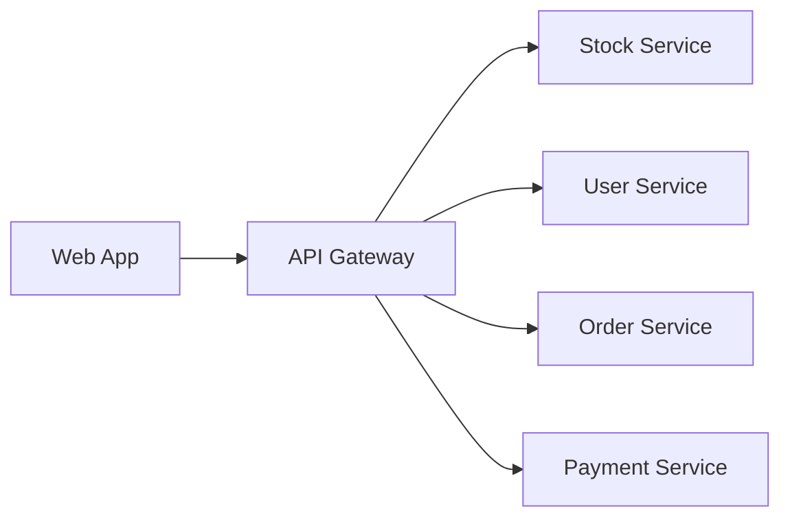
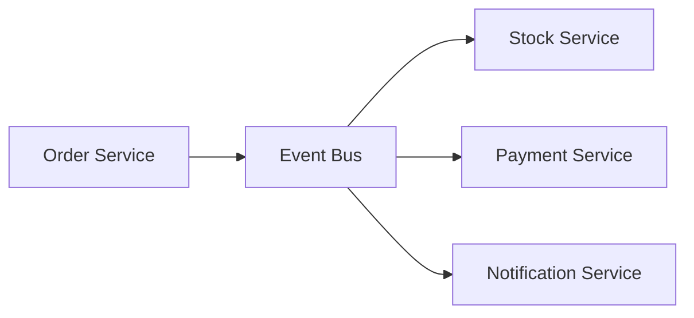

# TossErp Architecture Documentation

## System Overview

TossErp is built using a modern microservices architecture that promotes scalability, maintainability, and resilience. The system follows Domain-Driven Design (DDD) principles and implements Clean Architecture patterns.

## Architecture Principles

### 1. Single Responsibility Principle
Each microservice is responsible for a specific business domain:
- **Stock Service**: Inventory and catalog management
- **User Service**: User management and authentication
- **Order Service**: Order processing and fulfillment
- **Payment Service**: Payment processing and financial management

### 2. Loose Coupling
Services communicate through well-defined APIs and events:
- **Synchronous**: REST APIs for direct requests
- **Asynchronous**: Event-driven communication for decoupled operations
- **API Gateway**: Centralized routing and cross-cutting concerns

### 3. High Cohesion
Related functionality is grouped within the same service:
- **Domain Logic**: Business rules and entities
- **Data Access**: Repository pattern for data persistence
- **External Integrations**: Third-party service adapters

## Architecture Layers

### 1. Presentation Layer
- **API Gateway**: YARP-based reverse proxy
- **Web Application**: Vue.js/Nuxt.js SPA
- **Mobile Application**: Flutter mobile app
- **Admin Dashboard**: Administrative interface

### 2. Application Layer
- **Use Cases**: Application services implementing business workflows
- **DTOs**: Data transfer objects for API communication
- **Validation**: Input validation and business rule enforcement
- **CQRS**: Command Query Responsibility Segregation

### 3. Domain Layer
- **Entities**: Core business objects with identity
- **Value Objects**: Immutable objects representing concepts
- **Domain Services**: Business logic that spans multiple entities
- **Domain Events**: Events representing business occurrences

### 4. Infrastructure Layer
- **Data Access**: Entity Framework Core repositories
- **External Services**: Third-party API integrations
- **Message Bus**: Event publishing and subscription
- **Caching**: Redis-based caching layer

## Service Communication

### Synchronous Communication


### Asynchronous Communication


## Data Architecture

### Database Per Service
Each microservice owns its data:
- **Stock Service**: Inventory and catalog data
- **User Service**: User profiles and authentication data
- **Order Service**: Order and fulfillment data
- **Payment Service**: Payment and financial data

### Event Sourcing
For audit trails and temporal queries:
- **Domain Events**: Stored as event streams
- **Event Handlers**: Process events for side effects
- **Event Replay**: Rebuild state from events

### CQRS Pattern
Separate read and write models:
- **Commands**: Write operations with business logic
- **Queries**: Read operations optimized for performance
- **Projections**: Denormalized views for complex queries

## Security Architecture

### Authentication
- **JWT Tokens**: Stateless authentication
- **OAuth 2.0**: Third-party authentication
- **API Keys**: Service-to-service authentication

### Authorization
- **Role-Based Access Control (RBAC)**: User roles and permissions
- **Policy-Based Authorization**: Fine-grained access control
- **Resource-Based Authorization**: Object-level permissions

### Data Protection
- **Encryption at Rest**: Database encryption
- **Encryption in Transit**: TLS/SSL for all communications
- **Secrets Management**: Kubernetes secrets and external secret operators

## Resilience Patterns

### Circuit Breaker
Prevents cascading failures:
```csharp
services.AddHttpClient<StockServiceClient>()
    .AddPolicyHandler(GetCircuitBreakerPolicy());
```

### Retry Policy
Handles transient failures:
```csharp
services.AddHttpClient<PaymentServiceClient>()
    .AddPolicyHandler(GetRetryPolicy());
```

### Bulkhead Isolation
Isolates failures between services:
```csharp
services.AddHttpClient<OrderServiceClient>()
    .AddPolicyHandler(GetBulkheadPolicy());
```

## Monitoring and Observability

### Metrics
- **Application Metrics**: Request rates, response times, error rates
- **Business Metrics**: Orders, revenue, inventory levels
- **Infrastructure Metrics**: CPU, memory, disk usage

### Logging
- **Structured Logging**: JSON-formatted logs with correlation IDs
- **Log Levels**: Debug, Info, Warning, Error
- **Centralized Logging**: ELK stack for aggregation and analysis

### Tracing
- **Distributed Tracing**: OpenTelemetry for request tracing
- **Span Correlation**: Track requests across service boundaries
- **Performance Analysis**: Identify bottlenecks and optimization opportunities

## Deployment Architecture

### Containerization
- **Docker**: Containerized services for consistency
- **Multi-stage Builds**: Optimized production images
- **Health Checks**: Container health monitoring

### Orchestration
- **Kubernetes**: Container orchestration and scaling
- **Service Mesh**: Istio for service-to-service communication
- **Ingress Controller**: NGINX for external traffic routing

### Infrastructure as Code
- **Terraform**: Infrastructure provisioning
- **Helm Charts**: Kubernetes application packaging
- **GitOps**: Declarative infrastructure management

## Scalability Patterns

### Horizontal Scaling
- **Stateless Services**: Scale horizontally without data concerns
- **Load Balancing**: Distribute traffic across instances
- **Auto-scaling**: Kubernetes HPA for automatic scaling

### Database Scaling
- **Read Replicas**: Scale read operations
- **Sharding**: Distribute data across multiple databases
- **Caching**: Redis for frequently accessed data

### Event-Driven Scaling
- **Event Streaming**: Apache Kafka for high-throughput messaging
- **Event Processing**: Parallel event processing
- **Backpressure Handling**: Flow control for high-load scenarios

## Development Workflow

### Local Development
1. **Docker Compose**: Local service orchestration
2. **Hot Reload**: Fast development iteration
3. **Local Databases**: Isolated development data
4. **Service Discovery**: Local service registration

### Testing Strategy
- **Unit Tests**: Service-level business logic testing
- **Integration Tests**: Service interaction testing
- **Contract Tests**: API contract validation
- **End-to-End Tests**: Full system workflow testing

### CI/CD Pipeline
- **Source Control**: Git-based version control
- **Automated Testing**: Comprehensive test automation
- **Security Scanning**: Vulnerability and dependency scanning
- **Deployment**: Automated deployment to environments

## Performance Considerations

### Caching Strategy
- **Application Cache**: In-memory caching for frequently accessed data
- **Distributed Cache**: Redis for shared caching
- **CDN**: Content delivery network for static assets
- **Database Cache**: Query result caching

### Database Optimization
- **Indexing**: Strategic database indexing
- **Query Optimization**: Efficient database queries
- **Connection Pooling**: Database connection management
- **Read Replicas**: Scale read operations

### API Optimization
- **Pagination**: Large dataset handling
- **Compression**: Response compression
- **Caching**: API response caching
- **Rate Limiting**: API usage control

## Disaster Recovery

### Backup Strategy
- **Database Backups**: Regular automated backups
- **Configuration Backups**: Infrastructure configuration backups
- **Application Backups**: Application state backups
- **Cross-Region Replication**: Geographic redundancy

### Recovery Procedures
- **RTO (Recovery Time Objective)**: 4 hours maximum downtime
- **RPO (Recovery Point Objective)**: 1 hour maximum data loss
- **Failover Procedures**: Automated failover mechanisms
- **Data Validation**: Post-recovery data integrity checks

## Future Considerations

### Technology Evolution
- **Service Mesh**: Advanced service-to-service communication
- **Serverless**: Event-driven serverless functions
- **Edge Computing**: Distributed edge processing
- **AI/ML Integration**: Machine learning capabilities

### Scalability Evolution
- **Multi-Region**: Geographic distribution
- **Multi-Cloud**: Cloud provider diversity
- **Hybrid Cloud**: On-premises and cloud integration
- **Edge Deployment**: Edge computing integration
