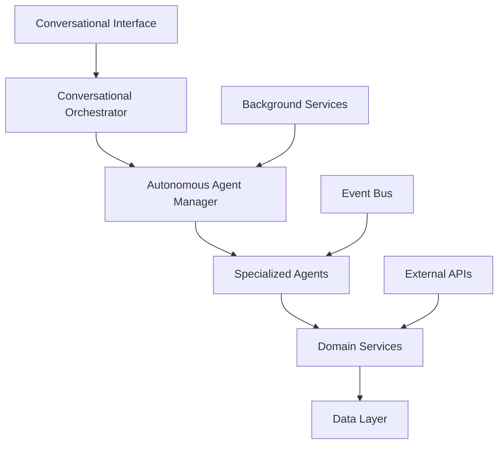

# Service-as-a-Software Development Guide

## Overview

This guide provides developers with comprehensive information on implementing and extending Service-as-a-Software features in the TOSS ERP III platform. It covers architecture patterns, implementation guidelines, and best practices for building autonomous business services.

## Table of Contents

- [Architecture Overview](#architecture-overview)
- [Core Components](#core-components)
- [Implementation Patterns](#implementation-patterns)
- [Creating New Agents](#creating-new-agents)
- [Integration Guidelines](#integration-guidelines)
- [Testing Strategies](#testing-strategies)
- [Deployment Considerations](#deployment-considerations)
- [Performance Optimization](#performance-optimization)
- [Security Best Practices](#security-best-practices)
- [Monitoring and Observability](#monitoring-and-observability)

## Prerequisites

Before working with Service-as-a-Software features, ensure you have:

- **.NET 8 SDK** installed
- **Understanding of Clean Architecture** principles
- **Familiarity with CQRS** and event-driven patterns
- **Knowledge of dependency injection** and IoC containers
- **Experience with async/await** patterns
- **Understanding of microservices** architecture

## Related Documents

- [Service-as-a-Software Implementation](SERVICE_AS_SOFTWARE_IMPLEMENTATION.md)
- [AI Service API Reference](api/ai-service-api-reference.md)
- [Architecture Documentation](architecture/README.md)
- [API Integration Guide](integration/api-integration-guide.md)

## Architecture Overview

The Service-as-a-Software architecture follows a layered approach with clear separation of concerns:



### Key Architectural Principles

1. **Separation of Concerns**: Each component has a single responsibility
2. **Dependency Inversion**: High-level modules don't depend on low-level modules
3. **Event-Driven**: Components communicate through events
4. **Async-First**: All operations are designed for asynchronous execution
5. **Resilient**: Built-in error handling and retry mechanisms

## Core Components

### 1. Conversational Orchestrator

The orchestrator is responsible for understanding user intent and routing requests to appropriate agents.

**Key Responsibilities:**
- Natural language processing
- Intent classification
- Context management
- Response generation

**Implementation Example:**

```csharp
// src/Services/ai/Orchestration/ConversationalOrchestrator.cs
public class ConversationalOrchestrator : IConversationalOrchestrator
{
    private readonly IAutonomousAgentManager _agentManager;
    private readonly ILogger<ConversationalOrchestrator> _logger;

    public ConversationalOrchestrator(
        IAutonomousAgentManager agentManager,
        ILogger<ConversationalOrchestrator> logger)
    {
        _agentManager = agentManager;
        _logger = logger;
    }

    public async Task<ConversationResponse> ProcessConversationAsync(ConversationRequest request)
    {
        try
        {
            // Analyze user intent
            var intent = await AnalyzeIntentAsync(request.Message);
            
            // Route to appropriate agent
            var result = await RouteToAgentAsync(intent, request);
            
            return new ConversationResponse
            {
                Response = result.Response,
                Actions = result.Actions,
                Intent = intent,
                Suggestions = GenerateSuggestions(intent)
            };
        }
        catch (Exception ex)
        {
            _logger.LogError(ex, "Error processing conversation for user {UserId}", request.UserId);
            return CreateErrorResponse(ex);
        }
    }

    private async Task<ServiceIntent> AnalyzeIntentAsync(string message)
    {
        // Implement intent analysis logic
        // This could use NLP libraries, ML models, or rule-based systems
        var keywords = ExtractKeywords(message);
        var intent = ClassifyIntent(keywords);
        
        return new ServiceIntent
        {
            Primary = intent,
            Confidence = CalculateConfidence(keywords),
            Entities = ExtractEntities(message)
        };
    }
}
```

### 2. Autonomous Agent Manager

The agent manager coordinates all autonomous services and provides a unified interface.

**Key Responsibilities:**
- Service coordination
- Action execution
- Status monitoring
- Configuration management

**Implementation Example:**

```csharp
// src/Services/ai/Services/AutonomousAgentManager.cs
public class AutonomousAgentManager : IAutonomousAgentManager
{
    private readonly Dictionary<string, IAutonomousAgent> _agents;
    private readonly ILogger<AutonomousAgentManager> _logger;

    public AutonomousAgentManager(
        IEnumerable<IAutonomousAgent> agents,
        ILogger<AutonomousAgentManager> logger)
    {
        _agents = agents.ToDictionary(a => a.ServiceName, a => a);
        _logger = logger;
    }

    public async Task<AutonomousActionResult> ExecuteActionAsync(
        string service, 
        string action, 
        Dictionary<string, object> parameters)
    {
        if (!_agents.TryGetValue(service, out var agent))
        {
            throw new ArgumentException($"Unknown service: {service}");
        }

        try
        {
            _logger.LogInformation("Executing action {Action} for service {Service}", action, service);
            
            var result = await agent.ExecuteActionAsync(action, parameters);
            
            _logger.LogInformation("Action {Action} completed successfully for service {Service}", 
                action, service);
            
            return result;
        }
        catch (Exception ex)
        {
            _logger.LogError(ex, "Error executing action {Action} for service {Service}", 
                action, service);
            throw;
        }
    }
}
```

### 3. Specialized Agents

Each agent specializes in a specific business domain and implements autonomous logic.

**Implementation Pattern:**

```csharp
// Base agent interface
public interface IAutonomousAgent
{
    string ServiceName { get; }
    Task<AutonomousActionResult> ExecuteActionAsync(string action, Dictionary<string, object> parameters);
    Task<ServiceStatus> GetStatusAsync();
}

// Example: Inventory Agent
public class InventoryAgent : IAutonomousAgent
{
    public string ServiceName => "inventory";
    
    private readonly IInventoryService _inventoryService;
    private readonly ILogger<InventoryAgent> _logger;

    public InventoryAgent(
        IInventoryService inventoryService,
        ILogger<InventoryAgent> logger)
    {
        _inventoryService = inventoryService;
        _logger = logger;
    }

    public async Task<AutonomousActionResult> ExecuteActionAsync(
        string action, 
        Dictionary<string, object> parameters)
    {
        return action switch
        {
            "check_stock_levels" => await CheckStockLevelsAsync(parameters),
            "reorder_low_stock" => await ReorderLowStockAsync(parameters),
            "optimize_inventory" => await OptimizeInventoryAsync(parameters),
            _ => throw new ArgumentException($"Unknown action: {action}")
        };
    }

    private async Task<AutonomousActionResult> CheckStockLevelsAsync(Dictionary<string, object> parameters)
    {
        var items = await _inventoryService.GetLowStockItemsAsync();
        
        return new AutonomousActionResult
        {
            Success = true,
            Data = new
            {
                LowStockItems = items,
                TotalItems = items.Count,
                EstimatedValue = items.Sum(i => i.Value * i.UnitPrice)
            },
            Actions = new[]
            {
                new ActionRecord
                {
                    Type = "stock_check",
                    Description = $"Checked {items.Count} low stock items",
                    Timestamp = DateTime.UtcNow
                }
            }
        };
    }
}
```

## Implementation Patterns

### 1. Command Pattern for Actions

Use the command pattern to encapsulate autonomous actions:

```csharp
public interface IAutonomousCommand
{
    string ActionName { get; }
    Task<AutonomousActionResult> ExecuteAsync(Dictionary<string, object> parameters);
}

public class ReorderLowStockCommand : IAutonomousCommand
{
    public string ActionName => "reorder_low_stock";
    
    private readonly IInventoryService _inventoryService;
    private readonly IPurchasingService _purchasingService;

    public ReorderLowStockCommand(
        IInventoryService inventoryService,
        IPurchasingService purchasingService)
    {
        _inventoryService = inventoryService;
        _purchasingService = purchasingService;
    }

    public async Task<AutonomousActionResult> ExecuteAsync(Dictionary<string, object> parameters)
    {
        var threshold = parameters.GetValueOrDefault("threshold", 10);
        var lowStockItems = await _inventoryService.GetItemsBelowThresholdAsync((int)threshold);
        
        var orders = new List<PurchaseOrder>();
        foreach (var item in lowStockItems)
        {
            var order = await _purchasingService.CreateOrderAsync(item);
            orders.Add(order);
        }

        return new AutonomousActionResult
        {
            Success = true,
            Data = new { OrdersCreated = orders.Count, Orders = orders },
            Actions = new[]
            {
                new ActionRecord
                {
                    Type = "purchase_orders_created",
                    Description = $"Created {orders.Count} purchase orders",
                    Timestamp = DateTime.UtcNow
                }
            }
        };
    }
}
```

### 2. Event-Driven Communication

Use events to decouple components and enable reactive behavior:

```csharp
public class InventoryLowStockEvent : IntegrationEvent
{
    public Guid ItemId { get; set; }
    public string ItemName { get; set; }
    public int CurrentStock { get; set; }
    public int Threshold { get; set; }
    public DateTime DetectedAt { get; set; }
}

public class InventoryAgent : IAutonomousAgent
{
    private readonly IEventBus _eventBus;

    public async Task MonitorStockLevelsAsync()
    {
        var lowStockItems = await _inventoryService.GetLowStockItemsAsync();
        
        foreach (var item in lowStockItems)
        {
            await _eventBus.PublishAsync(new InventoryLowStockEvent
            {
                ItemId = item.Id,
                ItemName = item.Name,
                CurrentStock = item.StockLevel,
                Threshold = item.ReorderThreshold,
                DetectedAt = DateTime.UtcNow
            });
        }
    }
}

public class InventoryEventHandler : IIntegrationEventHandler<InventoryLowStockEvent>
{
    public async Task HandleAsync(InventoryLowStockEvent @event)
    {
        // Handle low stock event - could trigger reordering, notifications, etc.
        await _notificationService.SendLowStockAlertAsync(@event);
        await _purchasingService.CreateReorderRequestAsync(@event);
    }
}
```

### 3. Configuration-Driven Behavior

Make agents configurable through settings:

```csharp
public class AgentConfiguration
{
    public bool Enabled { get; set; } = true;
    public TimeSpan CheckInterval { get; set; } = TimeSpan.FromHours(4);
    public Dictionary<string, object> Settings { get; set; } = new();
}

public class InventoryAgentConfiguration : AgentConfiguration
{
    public int ReorderThreshold { get; set; } = 10;
    public bool AutoReorder { get; set; } = true;
    public decimal MaxOrderValue { get; set; } = 5000m;
    public string[] PreferredSuppliers { get; set; } = Array.Empty<string>();
}

public class ConfigurableInventoryAgent : IAutonomousAgent
{
    private readonly InventoryAgentConfiguration _config;

    public async Task<AutonomousActionResult> ExecuteActionAsync(
        string action, 
        Dictionary<string, object> parameters)
    {
        if (!_config.Enabled)
        {
            throw new InvalidOperationException("Inventory agent is disabled");
        }

        // Use configuration to determine behavior
        var threshold = parameters.GetValueOrDefault("threshold", _config.ReorderThreshold);
        
        // Implementation...
    }
}
```

## Creating New Agents

### Step 1: Define the Agent Interface

```csharp
public interface IMarketingAgent : IAutonomousAgent
{
    Task<AutonomousActionResult> SendPromotionalCampaignAsync(Dictionary<string, object> parameters);
    Task<AutonomousActionResult> AnalyzeCustomerSegmentsAsync(Dictionary<string, object> parameters);
    Task<AutonomousActionResult> GenerateMarketingInsightsAsync(Dictionary<string, object> parameters);
}
```

### Step 2: Implement the Agent

```csharp
public class MarketingAgent : IMarketingAgent
{
    public string ServiceName => "marketing";
    
    private readonly ICustomerService _customerService;
    private readonly IEmailService _emailService;
    private readonly IAnalyticsService _analyticsService;

    public MarketingAgent(
        ICustomerService customerService,
        IEmailService emailService,
        IAnalyticsService analyticsService)
    {
        _customerService = customerService;
        _emailService = emailService;
        _analyticsService = analyticsService;
    }

    public async Task<AutonomousActionResult> ExecuteActionAsync(
        string action, 
        Dictionary<string, object> parameters)
    {
        return action switch
        {
            "send_promotional_campaign" => await SendPromotionalCampaignAsync(parameters),
            "analyze_customer_segments" => await AnalyzeCustomerSegmentsAsync(parameters),
            "generate_marketing_insights" => await GenerateMarketingInsightsAsync(parameters),
            _ => throw new ArgumentException($"Unknown action: {action}")
        };
    }

    public async Task<AutonomousActionResult> SendPromotionalCampaignAsync(Dictionary<string, object> parameters)
    {
        var campaignType = parameters.GetValueOrDefault("campaign_type", "general");
        var targetSegment = parameters.GetValueOrDefault("target_segment", "all");
        
        var customers = await _customerService.GetCustomersBySegmentAsync(targetSegment);
        var campaign = await CreateCampaignAsync(campaignType, customers);
        
        var sentCount = await _emailService.SendCampaignAsync(campaign);
        
        return new AutonomousActionResult
        {
            Success = true,
            Data = new { CampaignSent = sentCount, TargetSegment = targetSegment },
            Actions = new[]
            {
                new ActionRecord
                {
                    Type = "promotional_campaign_sent",
                    Description = $"Sent campaign to {sentCount} customers",
                    Timestamp = DateTime.UtcNow
                }
            }
        };
    }
}
```

### Step 3: Register the Agent

```csharp
// In Program.cs or Startup.cs
builder.Services.AddScoped<IMarketingAgent, MarketingAgent>();
builder.Services.AddScoped<IAutonomousAgent>(sp => sp.GetRequiredService<IMarketingAgent>());
```

### Step 4: Add Configuration

```csharp
public class MarketingAgentConfiguration : AgentConfiguration
{
    public string[] AllowedCampaignTypes { get; set; } = { "general", "seasonal", "loyalty" };
    public int MaxEmailsPerHour { get; set; } = 1000;
    public bool RequireApproval { get; set; } = true;
    public string[] ExcludedSegments { get; set; } = Array.Empty<string>();
}
```

## Integration Guidelines

### 1. External Service Integration

When integrating with external services, use adapters and implement retry logic:

```csharp
public interface IExternalServiceAdapter
{
    Task<T> ExecuteWithRetryAsync<T>(Func<Task<T>> operation, int maxRetries = 3);
}

public class SupplierApiAdapter : IExternalServiceAdapter
{
    private readonly HttpClient _httpClient;
    private readonly ILogger<SupplierApiAdapter> _logger;

    public async Task<T> ExecuteWithRetryAsync<T>(Func<Task<T>> operation, int maxRetries = 3)
    {
        for (int i = 0; i <= maxRetries; i++)
        {
            try
            {
                return await operation();
            }
            catch (HttpRequestException ex) when (i < maxRetries)
            {
                _logger.LogWarning(ex, "Attempt {Attempt} failed, retrying...", i + 1);
                await Task.Delay(TimeSpan.FromSeconds(Math.Pow(2, i)));
            }
        }
        throw new Exception("Max retries exceeded");
    }

    public async Task<OrderResponse> PlaceOrderAsync(OrderRequest request)
    {
        return await ExecuteWithRetryAsync(async () =>
        {
            var response = await _httpClient.PostAsJsonAsync("/api/orders", request);
            response.EnsureSuccessStatusCode();
            return await response.Content.ReadFromJsonAsync<OrderResponse>();
        });
    }
}
```

### 2. Database Integration

Use repository pattern for data access:

```csharp
public interface IInventoryRepository
{
    Task<IEnumerable<InventoryItem>> GetLowStockItemsAsync(int threshold);
    Task UpdateStockLevelAsync(Guid itemId, int newLevel);
    Task<IEnumerable<InventoryItem>> GetItemsByCategoryAsync(string category);
}

public class InventoryRepository : IInventoryRepository
{
    private readonly DbContext _context;

    public async Task<IEnumerable<InventoryItem>> GetLowStockItemsAsync(int threshold)
    {
        return await _context.InventoryItems
            .Where(i => i.StockLevel <= threshold)
            .Include(i => i.Supplier)
            .ToListAsync();
    }
}
```

### 3. Event Integration

Integrate with the event bus for reactive behavior:

```csharp
public class InventoryAgent : IAutonomousAgent
{
    private readonly IEventBus _eventBus;
    private readonly IInventoryRepository _repository;

    public async Task MonitorAndNotifyAsync()
    {
        var lowStockItems = await _repository.GetLowStockItemsAsync(10);
        
        foreach (var item in lowStockItems)
        {
            await _eventBus.PublishAsync(new LowStockDetectedEvent
            {
                ItemId = item.Id,
                ItemName = item.Name,
                CurrentStock = item.StockLevel,
                Threshold = 10,
                DetectedAt = DateTime.UtcNow
            });
        }
    }
}
```

## Testing Strategies

### 1. Unit Testing

Test individual agent methods:

```csharp
[Test]
public async Task CheckStockLevels_WithLowStockItems_ReturnsCorrectResult()
{
    // Arrange
    var mockInventoryService = new Mock<IInventoryService>();
    var lowStockItems = new List<InventoryItem>
    {
        new() { Id = Guid.NewGuid(), Name = "Bread", StockLevel = 5, ReorderThreshold = 10 }
    };
    mockInventoryService.Setup(s => s.GetLowStockItemsAsync())
        .ReturnsAsync(lowStockItems);

    var agent = new InventoryAgent(mockInventoryService.Object, Mock.Of<ILogger<InventoryAgent>>());

    // Act
    var result = await agent.ExecuteActionAsync("check_stock_levels", new Dictionary<string, object>());

    // Assert
    Assert.IsTrue(result.Success);
    Assert.AreEqual(1, ((dynamic)result.Data).LowStockItems.Count);
    Assert.AreEqual("Bread", ((dynamic)result.Data).LowStockItems[0].Name);
}
```

### 2. Integration Testing

Test agent interactions:

```csharp
[Test]
public async Task InventoryAgent_WithLowStock_TriggersReorderEvent()
{
    // Arrange
    var eventBus = new InMemoryEventBus();
    var inventoryService = new TestInventoryService();
    var agent = new InventoryAgent(inventoryService, eventBus);

    // Act
    await agent.MonitorAndNotifyAsync();

    // Assert
    var events = eventBus.GetPublishedEvents<LowStockDetectedEvent>();
    Assert.AreEqual(1, events.Count);
    Assert.AreEqual("Bread", events[0].ItemName);
}
```

### 3. End-to-End Testing

Test complete workflows:

```csharp
[Test]
public async Task CompleteWorkflow_LowStockDetection_To_OrderPlacement()
{
    // Arrange
    var testHarness = new TestHarness();
    await testHarness.SetupAsync();

    // Act
    var conversationResponse = await testHarness.ProcessConversationAsync(
        new ConversationRequest
        {
            UserId = "test-user",
            Message = "Check my inventory and reorder if needed"
        });

    // Assert
    Assert.IsTrue(conversationResponse.Success);
    Assert.Contains("reorder", conversationResponse.Response.ToLower());
    
    var orders = await testHarness.GetPurchaseOrdersAsync();
    Assert.Greater(orders.Count, 0);
}
```

## Deployment Considerations

### 1. Configuration Management

Use environment-specific configuration:

```json
{
  "AgentSettings": {
    "Inventory": {
      "Enabled": true,
      "CheckInterval": "00:04:00",
      "ReorderThreshold": 10,
      "AutoReorder": true
    },
    "Sales": {
      "Enabled": true,
      "CheckInterval": "00:01:00",
      "AutoFollowUp": true
    }
  },
  "ExternalServices": {
    "SupplierApi": {
      "BaseUrl": "https://api.supplier.com",
      "Timeout": "00:30:00",
      "RetryCount": 3
    }
  }
}
```

### 2. Health Checks

Implement health checks for agents:

```csharp
public class AgentHealthCheck : IHealthCheck
{
    private readonly IAutonomousAgentManager _agentManager;

    public async Task<HealthCheckResult> CheckHealthAsync(
        HealthCheckContext context, 
        CancellationToken cancellationToken = default)
    {
        try
        {
            var status = await _agentManager.GetServiceStatusAsync();
            
            if (status.OverallStatus == "healthy")
            {
                return HealthCheckResult.Healthy("All agents are healthy");
            }
            
            return HealthCheckResult.Degraded("Some agents are experiencing issues");
        }
        catch (Exception ex)
        {
            return HealthCheckResult.Unhealthy("Agent health check failed", ex);
        }
    }
}
```

### 3. Monitoring and Logging

Implement comprehensive logging:

```csharp
public class InventoryAgent : IAutonomousAgent
{
    private readonly ILogger<InventoryAgent> _logger;

    public async Task<AutonomousActionResult> ExecuteActionAsync(
        string action, 
        Dictionary<string, object> parameters)
    {
        using var scope = _logger.BeginScope(new Dictionary<string, object>
        {
            ["Action"] = action,
            ["Parameters"] = parameters
        });

        _logger.LogInformation("Starting inventory action {Action}", action);

        try
        {
            var result = await ExecuteActionInternalAsync(action, parameters);
            
            _logger.LogInformation("Inventory action {Action} completed successfully", action);
            
            return result;
        }
        catch (Exception ex)
        {
            _logger.LogError(ex, "Inventory action {Action} failed", action);
            throw;
        }
    }
}
```

## Performance Optimization

### 1. Caching Strategies

Implement caching for frequently accessed data:

```csharp
public class CachedInventoryAgent : IAutonomousAgent
{
    private readonly IMemoryCache _cache;
    private readonly IInventoryService _inventoryService;

    public async Task<AutonomousActionResult> CheckStockLevelsAsync(Dictionary<string, object> parameters)
    {
        var cacheKey = "inventory_low_stock";
        
        if (_cache.TryGetValue(cacheKey, out List<InventoryItem> cachedItems))
        {
            return CreateResultFromCachedData(cachedItems);
        }

        var items = await _inventoryService.GetLowStockItemsAsync();
        
        _cache.Set(cacheKey, items, TimeSpan.FromMinutes(5));
        
        return CreateResultFromData(items);
    }
}
```

### 2. Async Processing

Use background services for long-running tasks:

```csharp
public class InventoryMonitoringService : BackgroundService
{
    protected override async Task ExecuteAsync(CancellationToken stoppingToken)
    {
        while (!stoppingToken.IsCancellationRequested)
        {
            try
            {
                await MonitorInventoryAsync();
                await Task.Delay(TimeSpan.FromMinutes(5), stoppingToken);
            }
            catch (Exception ex)
            {
                _logger.LogError(ex, "Error in inventory monitoring");
                await Task.Delay(TimeSpan.FromMinutes(1), stoppingToken);
            }
        }
    }
}
```

### 3. Batch Processing

Process multiple items in batches:

```csharp
public async Task<AutonomousActionResult> ProcessBatchOrdersAsync(List<OrderRequest> orders)
{
    const int batchSize = 10;
    var results = new List<OrderResult>();

    for (int i = 0; i < orders.Count; i += batchSize)
    {
        var batch = orders.Skip(i).Take(batchSize);
        var batchResults = await ProcessOrderBatchAsync(batch);
        results.AddRange(batchResults);
    }

    return new AutonomousActionResult
    {
        Success = true,
        Data = new { ProcessedOrders = results.Count, Results = results }
    };
}
```

## Security Best Practices

### 1. Input Validation

Validate all inputs to prevent injection attacks:

```csharp
public class ValidatedInventoryAgent : IAutonomousAgent
{
    public async Task<AutonomousActionResult> ExecuteActionAsync(
        string action, 
        Dictionary<string, object> parameters)
    {
        // Validate action
        if (string.IsNullOrWhiteSpace(action))
            throw new ArgumentException("Action cannot be null or empty");

        if (!IsValidAction(action))
            throw new ArgumentException($"Invalid action: {action}");

        // Validate parameters
        ValidateParameters(action, parameters);

        return await ExecuteValidatedActionAsync(action, parameters);
    }

    private bool IsValidAction(string action)
    {
        return new[] { "check_stock_levels", "reorder_low_stock", "optimize_inventory" }
            .Contains(action);
    }

    private void ValidateParameters(string action, Dictionary<string, object> parameters)
    {
        switch (action)
        {
            case "reorder_low_stock":
                if (parameters.ContainsKey("threshold"))
                {
                    var threshold = Convert.ToInt32(parameters["threshold"]);
                    if (threshold < 0 || threshold > 1000)
                        throw new ArgumentException("Threshold must be between 0 and 1000");
                }
                break;
        }
    }
}
```

### 2. Authentication and Authorization

Implement proper authentication:

```csharp
public class AuthenticatedAgentManager : IAutonomousAgentManager
{
    private readonly IHttpContextAccessor _httpContextAccessor;

    public async Task<AutonomousActionResult> ExecuteActionAsync(
        string service, 
        string action, 
        Dictionary<string, object> parameters)
    {
        var user = _httpContextAccessor.HttpContext?.User;
        if (user == null || !user.Identity.IsAuthenticated)
        {
            throw new UnauthorizedAccessException("User must be authenticated");
        }

        if (!await HasPermissionAsync(user, service, action))
        {
            throw new UnauthorizedAccessException($"User does not have permission for {service}:{action}");
        }

        return await _agentManager.ExecuteActionAsync(service, action, parameters);
    }
}
```

### 3. Data Encryption

Encrypt sensitive data:

```csharp
public class SecureInventoryAgent : IAutonomousAgent
{
    private readonly IDataProtector _protector;

    public async Task<AutonomousActionResult> ExecuteActionAsync(
        string action, 
        Dictionary<string, object> parameters)
    {
        // Encrypt sensitive parameters
        if (parameters.ContainsKey("credit_card"))
        {
            var encrypted = _protector.Protect(parameters["credit_card"].ToString());
            parameters["credit_card"] = encrypted;
        }

        var result = await _baseAgent.ExecuteActionAsync(action, parameters);

        // Decrypt sensitive response data
        if (result.Data is Dictionary<string, object> data && 
            data.ContainsKey("payment_info"))
        {
            var decrypted = _protector.Unprotect(data["payment_info"].ToString());
            data["payment_info"] = decrypted;
        }

        return result;
    }
}
```

## Monitoring and Observability

### 1. Metrics Collection

Collect performance metrics:

```csharp
public class MetricsInventoryAgent : IAutonomousAgent
{
    private readonly IMetrics _metrics;

    public async Task<AutonomousActionResult> ExecuteActionAsync(
        string action, 
        Dictionary<string, object> parameters)
    {
        var timer = _metrics.CreateTimer("inventory_action_duration");
        
        try
        {
            var result = await _baseAgent.ExecuteActionAsync(action, parameters);
            
            _metrics.Increment("inventory_action_success", new Dictionary<string, string>
            {
                ["action"] = action
            });
            
            return result;
        }
        catch (Exception ex)
        {
            _metrics.Increment("inventory_action_failure", new Dictionary<string, string>
            {
                ["action"] = action,
                ["error_type"] = ex.GetType().Name
            });
            throw;
        }
        finally
        {
            timer.Dispose();
        }
    }
}
```

### 2. Distributed Tracing

Implement tracing for request flows:

```csharp
public class TracedInventoryAgent : IAutonomousAgent
{
    private readonly ActivitySource _activitySource;

    public async Task<AutonomousActionResult> ExecuteActionAsync(
        string action, 
        Dictionary<string, object> parameters)
    {
        using var activity = _activitySource.StartActivity($"inventory.{action}");
        activity?.SetTag("action", action);
        activity?.SetTag("parameters", JsonSerializer.Serialize(parameters));

        try
        {
            var result = await _baseAgent.ExecuteActionAsync(action, parameters);
            
            activity?.SetTag("success", true);
            activity?.SetTag("result_count", result.Actions?.Count ?? 0);
            
            return result;
        }
        catch (Exception ex)
        {
            activity?.SetTag("success", false);
            activity?.SetTag("error", ex.Message);
            activity?.SetStatus(ActivityStatusCode.Error, ex.Message);
            throw;
        }
    }
}
```

### 3. Structured Logging

Use structured logging for better analysis:

```csharp
public class StructuredInventoryAgent : IAutonomousAgent
{
    private readonly ILogger<StructuredInventoryAgent> _logger;

    public async Task<AutonomousActionResult> ExecuteActionAsync(
        string action, 
        Dictionary<string, object> parameters)
    {
        _logger.LogInformation("Starting inventory action {Action} with parameters {@Parameters}", 
            action, parameters);

        try
        {
            var result = await _baseAgent.ExecuteActionAsync(action, parameters);
            
            _logger.LogInformation("Inventory action {Action} completed successfully. " +
                "Actions taken: {ActionCount}", action, result.Actions?.Count ?? 0);
            
            return result;
        }
        catch (Exception ex)
        {
            _logger.LogError(ex, "Inventory action {Action} failed with parameters {@Parameters}", 
                action, parameters);
            throw;
        }
    }
}
```

## Conclusion

This development guide provides a comprehensive foundation for implementing Service-as-a-Software features in TOSS ERP III. By following these patterns and best practices, developers can create robust, scalable, and maintainable autonomous business services.

Key takeaways:

1. **Follow Clean Architecture** principles for maintainable code
2. **Use async/await** patterns for better performance
3. **Implement proper error handling** and retry logic
4. **Add comprehensive testing** at all levels
5. **Monitor and observe** system behavior
6. **Secure all endpoints** and data
7. **Optimize for performance** with caching and batching
8. **Use configuration-driven** behavior for flexibility

For additional resources and examples, refer to the related documentation and the existing codebase implementations.
