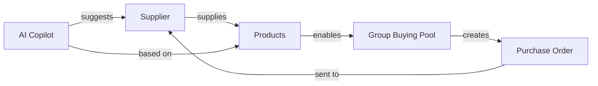

# Suppliers Integration Guide

## 🎯 Quick Reference: Suppliers → Products → Group Buying

**Date:** October 23, 2025  
**Module:** `/buying/suppliers/`  
**Status:** ✅ Production Ready

---

## 📍 Module Location

```
✅ NEW:  /buying/suppliers/
❌ OLD:  /stock/suppliers/ (deleted)
```

### Navigation Path
```
Dashboard → Buying → Suppliers
```

### URL
```
https://your-domain.com/buying/suppliers
```

---

## 🔗 Integration Flow



---

## 🚀 Quick Start Guide

### 1. Add a Supplier with Products

```typescript
// Navigate to /buying/suppliers
// Click "Add Supplier"

Supplier Form:
{
  name: "ABC Suppliers Ltd",           // Required
  category: "Food & Beverage",         // Required
  phone: "+27 11 123 4567",           // Required
  currency: "ZAR",
  paymentTerms: "Net 30",
  products: [                          // Required (min 1)
    "Canned Goods",
    "Beverages", 
    "Snacks"
  ]
}
```

### 2. Search by Product

```
User types: "beverages"
System returns: ABC Suppliers Ltd
```

### 3. Create Group Buying Pool

```typescript
// In /buying/group-buying/
// When user searches for "Canned Goods"

Auto-suggest: "ABC Suppliers supplies this product"
Pre-fill pool:
- Supplier: ABC Suppliers Ltd
- Currency: ZAR
- Payment: Net 30
- Available products: [Canned Goods, Beverages, Snacks]
```

---

## 🎨 Visual Guide

### Supplier Card View

```
┌─────────────────────────────────────────┐
│  [AB]  ABC Suppliers Ltd     ⭐⭐⭐⭐⭐  │
│                                         │
│  📧 contact@abc.co.za                   │
│  📞 +27 11 123 4567                     │
│  📍 Johannesburg, GP                    │
│  💰 ZAR                                 │
│                                         │
│  Performance:                           │
│  📦 124 Orders | 🎯 98% On-Time        │
│                                         │
│  Products & Services:                   │
│  ┌──────────────┐ ┌────────────┐       │
│  │Canned Goods  │ │Beverages   │       │
│  └──────────────┘ └────────────┘       │
│  ┌──────────┐ ┌─────────┐             │
│  │Snacks    │ │+1 more  │             │
│  └──────────┘ └─────────┘             │
│                                         │
│  [View Details]  [Contact]              │
└─────────────────────────────────────────┘
```

---

## 💻 Code Integration Examples

### Example 1: Find Suppliers by Product

```typescript
// In group-buying/index.vue
const findSuppliersForProduct = (productName: string) => {
  return suppliers.value.filter(supplier =>
    supplier.products.some(p =>
      p.toLowerCase().includes(productName.toLowerCase())
    )
  )
}

// Usage:
const suppliers = findSuppliersForProduct("Canned Goods")
// Returns: [{ name: "ABC Suppliers Ltd", products: [...], ... }]
```

### Example 2: Pre-fill Group Buying Pool

```typescript
// In CreatePoolModal.vue
const selectSupplierForPool = (supplier: any) => {
  newPool.value = {
    supplierId: supplier.id,
    supplierName: supplier.name,
    currency: supplier.currency,
    paymentTerms: supplier.paymentTerms,
    availableProducts: supplier.products
  }
}
```

### Example 3: AI Copilot Suggestion

```typescript
// In AI Copilot logic
const suggestSupplierForReorder = (itemName: string) => {
  const matchingSuppliers = suppliers.value.filter(s =>
    s.products.some(p => p.toLowerCase().includes(itemName.toLowerCase()))
  )
  
  // Sort by rating and on-time delivery
  return matchingSuppliers.sort((a, b) => {
    const scoreA = a.rating * 0.6 + (a.onTimeRate / 100) * 0.4
    const scoreB = b.rating * 0.6 + (b.onTimeRate / 100) * 0.4
    return scoreB - scoreA
  })[0]
}

// Usage:
const bestSupplier = suggestSupplierForReorder("Cooking Oil")
// AI: "XYZ Wholesalers (rated 4.8⭐) supplies this. Create pool?"
```

---

## 📊 Data Flow

### Supplier → Group Buying Pool

```typescript
// Step 1: User searches for product in group buying
const searchProduct = "Cleaning Supplies"

// Step 2: System finds suppliers
const suppliers = findSuppliersForProduct(searchProduct)
// Returns: [Industrial Supplies SA]

// Step 3: User selects supplier
const selectedSupplier = suppliers[0]

// Step 4: System creates pool with supplier data
const newPool = {
  id: generateId(),
  productName: searchProduct,
  supplierId: selectedSupplier.id,
  supplierName: selectedSupplier.name,
  currency: selectedSupplier.currency,        // ZAR
  paymentTerms: selectedSupplier.paymentTerms, // Net 30
  area: userLocation,
  targetQuantity: 100,
  currentQuantity: 0,
  status: 'open'
}
```

---

## 🔧 API Endpoints (Future)

### GET /api/suppliers

```json
{
  "suppliers": [
    {
      "id": 1,
      "name": "ABC Suppliers Ltd",
      "category": "Food & Beverage",
      "products": ["Canned Goods", "Beverages", "Snacks"],
      "currency": "ZAR",
      "paymentTerms": "Net 30",
      "rating": 5,
      "totalOrders": 124,
      "onTimeRate": 98,
      "status": "active"
    }
  ]
}
```

### GET /api/suppliers/search?product={productName}

```json
{
  "query": "Cleaning Supplies",
  "results": [
    {
      "id": 6,
      "name": "Industrial Supplies SA",
      "products": ["Cleaning Supplies", "Packaging Materials"],
      "rating": 5,
      "currency": "ZAR"
    }
  ]
}
```

### POST /api/suppliers

```json
{
  "name": "New Supplier Ltd",
  "category": "Hardware",
  "phone": "+27 11 111 1111",
  "products": ["Tools", "Equipment"],
  "currency": "ZAR",
  "paymentTerms": "COD"
}
```

---

## 🎯 Use Cases

### Use Case 1: Create Group Buying Pool

**Scenario:** User needs to buy "Office Supplies" in bulk

1. Navigate to `/buying/group-buying/`
2. Click "Create Pool"
3. Type "Office Supplies"
4. System suggests: "Office Pro Suppliers supplies this"
5. User selects supplier
6. Pool pre-filled with:
   - Supplier name
   - Available products from catalog
   - Payment terms: Net 30
   - Currency: ZAR
7. User sets quantity and deadline
8. Pool created and ready for invites

### Use Case 2: Smart Reordering

**Scenario:** AI detects low stock of "Beverages"

1. AI Copilot banner: "Low stock: Beverages"
2. System finds: ABC Suppliers (rated 5⭐, 98% on-time)
3. Suggests options:
   - Order Solo (R500 total)
   - Join Pool #12 (R425, save R75)
   - Create Pool (invite 5 nearby shops)
4. User chooses "Join Pool"
5. Linked to ABC Suppliers automatically

### Use Case 3: Multi-Supplier Comparison

**Scenario:** User wants best supplier for "Vegetables"

1. Search "vegetables"
2. Results:
   - XYZ Wholesalers (4⭐, ZAR, Net 30)
   - Fresh Produce Co (3⭐, ZAR, COD)
3. AI suggests: "XYZ Wholesalers has better rating and terms"
4. User selects XYZ Wholesalers
5. Creates pool with better terms

---

## 🧪 Testing Checklist

### Supplier Creation
- [ ] Add supplier with 1 product
- [ ] Add supplier with multiple products
- [ ] Try to add supplier without products (should fail)
- [ ] Verify product tags display on card

### Search Functionality
- [ ] Search by supplier name
- [ ] Search by product name
- [ ] Search by location
- [ ] Verify case-insensitive search

### Product Display
- [ ] Verify top 3 products shown
- [ ] Verify "+X more" badge for 4+ products
- [ ] Verify no products section hidden if 0 products
- [ ] Verify dark mode styling

### Integration
- [ ] Verify supplier appears in group buying search
- [ ] Verify currency carried over to pool
- [ ] Verify payment terms visible
- [ ] Verify AI suggestions use supplier data

---

## 🐛 Troubleshooting

### Issue: Supplier not showing in search

**Check:**
1. Supplier status is "active"
2. Products array is not empty
3. Product name matches search query
4. Search is case-insensitive

### Issue: Product tags not displaying

**Check:**
1. `supplier.products` array exists
2. Array is not empty
3. Products are strings, not objects

### Issue: Group buying pool not pre-filling

**Check:**
1. Supplier has `currency` field
2. Supplier has `paymentTerms` field
3. Products array is populated
4. Supplier ID is being passed correctly

---

## 📚 Related Documentation

- **Main Documentation**: `SUPPLIERS_MODULE_MVP.md`
- **Product Linking**: `SUPPLIER_PRODUCT_LINKING.md`
- **ERPNext Reference**: https://docs.frappe.io/erpnext/v13/user/manual/en/buying/supplier
- **Group Buying**: `IMPLEMENTATION_SUMMARY.md`

---

## 🎉 Key Benefits

1. **✅ Product-Centric**: Everything revolves around supplier-product relationships
2. **✅ Group Buying Ready**: Enables smart pool creation
3. **✅ AI-Powered**: Enables intelligent suggestions
4. **✅ Search-Optimized**: Find by what you need, not just who supplies
5. **✅ ERPNext Compliant**: Follows official structure
6. **✅ MVP Complete**: All critical features implemented

---

## 📞 Quick Links

- **Suppliers Page**: `/buying/suppliers/`
- **Group Buying**: `/buying/group-buying/`
- **Purchase Orders**: `/buying/orders/`
- **Buying Dashboard**: `/buying/`

---

**Status:** ✅ **PRODUCTION READY**  
**Integration:** ✅ **COMPLETE**  
**Documentation:** ✅ **COMPLETE**

